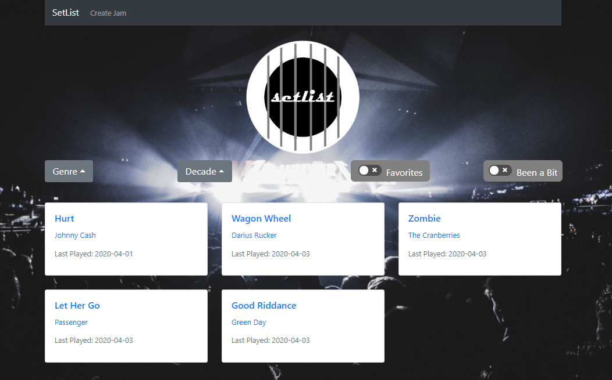
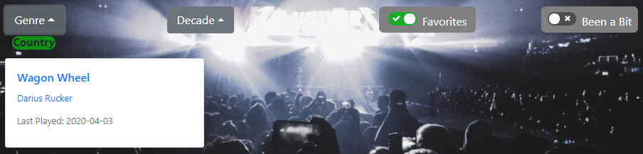
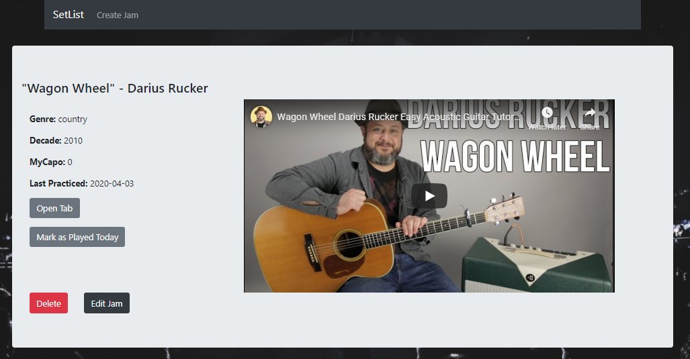
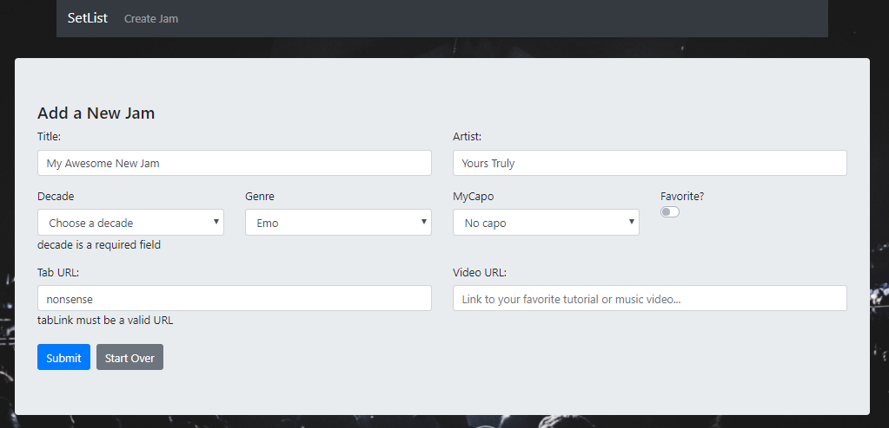

# setlist
Guitar tab &amp; tutorial management with MongoDB, Express, React, and Node.js

## About setlist

setlist was a fun exercise in building a RESTful API with Node, Express, and MongoDB, along with a React front end.  As a (very) amateur guitarist, I enjoyed building a tool to organize data, tabs, and tutorials on the songs I've learned.  In this section, I'll describe some of the features.

### The Dashboard

This is the landing page, complete with a list of all your songs (from here on lovingly referred to as *Jams*) and ways to filter them.
* On load, a complete list of the user's Jams are loaded via API call and rendered in a `bootstrap` grid.
* Each card has basic info about a Jam, and serves as a link to that Jam's info page
* Filters are available - by genre, decade, favorites, and songs that you haven't played in a while.
    - Your current filter choices are reflected on the screen
    - These filters can be combined.  Below, I felt like playing country song I'd favorited.
&nbsp;

&nbsp;

### Jam Details

This is the main page for a Jam, displaying its associated data and tutorials.  From here, the user may also edit or delete the Jam.
* **Mark as Played Today** lets the API know the user practiced this one today, and reflects on page and filters accordingly
* Tutorial video is embedded using [`ReactPlayer`](https://github.com/CookPete/react-player)
* **Edit Jam** opens a form (much like Create Jam - see below), where the user can update Jam data and submit via API
* **Delete Jam** asks user to confirm the deletion, and then the Jam is removed from the database

### Create Jam

Accessed via the nav bar, this is where the user enters Jam data:
* [`Formik`](https://github.com/jaredpalmer/formik) is used to handle form updates, validation (using [`Yup`](https://github.com/jquense/yup)), and submission
    - See the error message for required fields and URL format in the image
    - **Start Over** clears all inputs and provides a clean slate
* **Submit** adds the Jam to the database via API call.  The user would then see it on the Dashboard
